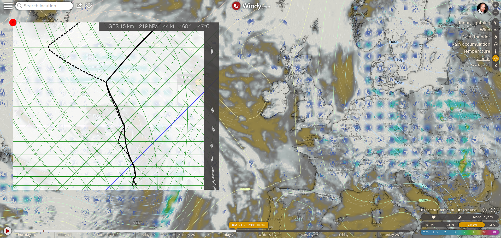

SkewT project for windy.com.

### What's a skewT?

A skewT, short for SkewT-LogP diagram, is a thermodynamic plot for displaying information about the upper atmosphere. It is a somewhat advanced diagram, and is most commonly used by meteorologists, pilots, and balloonists. 

The solid black line represents temperature, and the dashed black line represents dew point temperature. With a little practice, you can use a SkewT diagram to tell the cloud amounts, thermals, upper level winds, turbulence, icing, thunderstorm development potential, shear, and many other quantities – for the informed user, this diagram can tell you more about the atmosphere than any other single tool.

### Use on Windy.com

Install the plugin by selecting "Install Windy plugin" from the settings menu on windy.com, and entering "windy-plugin-skewt". The tool should also be available from the plugins list. If loaded sucessfully, a message should appear on the map prompting the user to click on a location. 

The default data displayed is from the ECMWF model. Select another model as usual in the bottom right hand corner of the screen to switch between models. 

At the surface, there is a purple circle. Sliding it will show a projected parcel ascent, which is useful for stability analysis. A lifted index (LI) value will also appear when the projected parcel shows increased instability (negative LI values indicate increasing instability). 

Written by John C. Kealy. Send a message to me on the windy community forum (community.windy.com) under the username `johnckealy` with any questions/comments.
